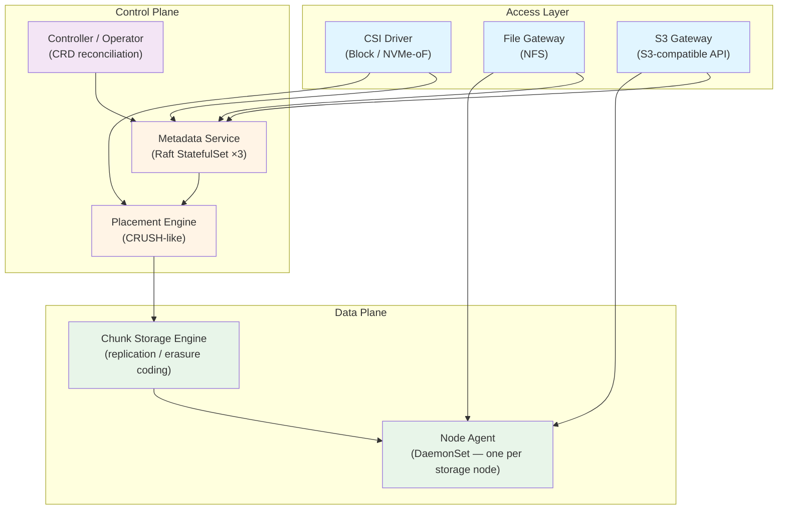

# NovaStor

**Unified Kubernetes-native storage — block, file, and object on a shared chunk engine**

NovaStor is a self-contained Kubernetes storage operator that provides block (CSI/NVMe-oF), shared file (NFS), and object (S3-compatible) storage through a single distributed chunk storage engine. No external runtime dependencies — no etcd, no Ceph, no ZooKeeper.

## Architecture

Everything in NovaStor is built on one core principle: **everything is chunks**. A block volume is an ordered sequence of 4 MB chunks. A file is chunks plus inode metadata. An object is chunks plus object metadata. One engine, three access layers.



### Components

| Component | Binary | Kubernetes Resource | Description |
|-----------|--------|-------------------|-------------|
| Chunk Storage Engine | (library) | — | Immutable 4 MB chunks with CRC-32C checksums; content-addressed IDs |
| Node Agent | `novastor-agent` | DaemonSet | Serves chunk reads/writes over gRPC from local disk |
| Metadata Service | `novastor-meta` | StatefulSet (×3) | Raft-backed store for volume, inode, and object mappings |
| Controller / Operator | `novastor-controller` | Deployment | Reconciles StoragePool, BlockVolume, SharedFilesystem, ObjectStore CRDs |
| CSI Driver | `novastor-csi` | DaemonSet + Deployment | Kubernetes CSI plugin for block provisioning and attachment |
| File Gateway | `novastor-filer` | Deployment | NFS server backed by the chunk engine |
| S3 Gateway | `novastor-s3gw` | Deployment | S3-compatible HTTP API backed by the chunk engine |
| Scheduler | `novastor-scheduler` | Deployment | Data-locality aware pod scheduler |
| Scheduler Webhook | `novastor-webhook` | Deployment | Mutating admission webhook for scheduler injection |
| CLI | `novastorctl` | — | Administrative command-line tool |

### Data Protection

Both modes are available for all three access layers. The choice is made per StoragePool.

| Mode | Overhead | Use Case |
|------|----------|----------|
| **Replication** | 3× (default factor=3) | Latency-sensitive workloads; synchronous N-way replication |
| **Erasure Coding** | 1.5× (default 4+2 Reed-Solomon) | Capacity-efficient workloads; tolerates any 2 shard failures |

## Quick Start

### Prerequisites

- Kubernetes 1.28+
- Helm 3.12+
- Persistent storage devices on worker nodes (NVMe, SSD, or HDD)

### Install with Helm

```bash
# Add the NovaStor Helm repository
helm repo add novastor https://piwi3910.github.io/novastor
helm repo update

# Install into the novastor-system namespace
helm install novastor novastor/novastor \
  --namespace novastor-system \
  --create-namespace \
  --set s3gw.accessKey=<your-access-key> \
  --set s3gw.secretKey=<your-secret-key>
```

### Install from source

```bash
git clone https://github.com/piwi3910/novastor.git
cd novastor

# Install CRDs first
kubectl apply -f deploy/crds/

# Install the chart from the local directory
helm install novastor deploy/helm/novastor/ \
  --namespace novastor-system \
  --create-namespace \
  --set s3gw.accessKey=<your-access-key> \
  --set s3gw.secretKey=<your-secret-key>
```

### Create a StoragePool and provision a volume

```yaml
# 1. Create a replicated storage pool across nodes labelled role=storage
apiVersion: novastor.io/v1alpha1
kind: StoragePool
metadata:
  name: nvme-replicated
spec:
  nodeSelector:
    matchLabels:
      role: storage
  deviceFilter:
    type: nvme
  dataProtection:
    mode: replication
    replication:
      factor: 3
      writeQuorum: 2
---
# 2. Provision a block volume from that pool
apiVersion: novastor.io/v1alpha1
kind: BlockVolume
metadata:
  name: my-volume
  namespace: default
spec:
  pool: nvme-replicated
  size: 100Gi
  accessMode: ReadWriteOnce
```

```bash
kubectl apply -f the-above.yaml

# Watch status
kubectl get sp,bv -o wide
```

## Building from Source

### Requirements

- Go 1.25+
- GNU Make
- `protoc` (for protobuf regeneration only)

### Build all binaries

```bash
make build-all
```

Binaries are written to `bin/`:

```
bin/novastor-controller
bin/novastor-agent
bin/novastor-meta
bin/novastor-csi
bin/novastor-filer
bin/novastor-s3gw
bin/novastor-scheduler
bin/novastor-webhook
bin/novastorctl
```

### Individual targets

```bash
make build-controller   # Controller / operator
make build-agent        # Node agent
make build-meta         # Metadata service
make build-csi          # CSI driver
make build-filer        # File (NFS) gateway
make build-s3gw         # S3 gateway
make build-cli          # novastorctl CLI
```

### Code generation

Run these after modifying types in `api/v1alpha1/` or `.proto` files.

```bash
make generate           # Regenerate deepcopy methods
make manifests          # Regenerate CRD YAML manifests
make generate-proto     # Regenerate gRPC/protobuf Go code
```

## Configuration Reference

### novastor-controller

| Flag | Default | Description |
|------|---------|-------------|
| `--metrics-bind-address` | `:8080` | Prometheus metrics endpoint |
| `--health-probe-bind-address` | `:8081` | Liveness and readiness probe endpoint |
| `--leader-elect` | `false` | Enable leader election for HA deployments |

### novastor-agent

| Flag | Default | Description |
|------|---------|-------------|
| `--listen` | `:9100` | gRPC listen address for chunk requests |
| `--data-dir` | `/var/lib/novastor/chunks` | Directory for chunk storage |
| `--meta-addr` | `localhost:7001` | Metadata service gRPC address |
| `--metrics-addr` | `:9101` | Prometheus metrics endpoint |
| `--scrub-interval` | `24h` | Interval between background integrity scrubs |
| `--tls-ca` | `""` | CA certificate path for mTLS (optional) |
| `--tls-cert` | `""` | Server certificate path for mTLS (optional) |
| `--tls-key` | `""` | Server key path for mTLS (optional) |

### novastor-meta

| Flag | Default | Description |
|------|---------|-------------|
| `--node-id` | _(hostname)_ | Unique Raft node identifier (defaults to hostname when empty) |
| `--data-dir` | `/var/lib/novastor/meta` | Raft log and snapshot directory |
| `--raft-addr` | `:7000` | Raft peer communication address |
| `--grpc-addr` | `:7001` | gRPC API address for clients |
| `--bootstrap-expect` | `0` | Number of nodes expected to bootstrap cluster (0 = join existing) |
| `--join` | `""` | Comma-separated peer addresses to join existing cluster |
| `--metrics-addr` | `:7002` | Prometheus metrics endpoint |

### novastor-csi

| Flag | Default | Description |
|------|---------|-------------|
| `--endpoint` | `unix:///var/lib/kubelet/plugins/novastor.csi.novastor.io/csi.sock` | CSI gRPC socket |
| `--node-id` | `""` | Node identifier (required on node DaemonSet pods) |
| `--meta-addr` | `localhost:7001` | Metadata service gRPC address |
| `--agent-addrs` | `""` | Comma-separated `nodeID=addr` pairs for all agents |

### novastor-filer

| Flag | Default | Description |
|------|---------|-------------|
| `--nfs-listen` | `:2049` | NFS listen address |
| `--meta-addr` | `localhost:7001` | Metadata service gRPC address |
| `--agent-addr` | `localhost:9100` | Chunk agent gRPC address |

### novastor-s3gw

| Flag | Default | Description |
|------|---------|-------------|
| `--listen` | `:9000` | HTTP listen address for S3 API |
| `--access-key` | `""` | S3 access key (required for authentication) |
| `--secret-key` | `""` | S3 secret key (required for authentication) |
| `--meta-addr` | `localhost:7001` | Metadata service gRPC address |
| `--agent-addr` | `localhost:9100` | Chunk agent gRPC address |

## Development Guide

### Running tests

```bash
# Unit and integration tests with race detection
make test

# Generate HTML coverage report
make test-coverage

# Benchmarks (chunk engine and placement)
make test-bench
```

### Linting

```bash
# Run golangci-lint
make lint

# Run all quality checks (fmt + vet + lint)
make check
```

### Helm chart

```bash
# Lint the chart
make helm-lint

# Render templates for inspection
make helm-template

# Install/upgrade/uninstall
make helm-install
make helm-upgrade
make helm-uninstall
```

### Documentation

The documentation site uses MkDocs with the Material theme.

```bash
# Serve docs locally with live reload
make docs-serve

# Build and validate (strict mode — fails on warnings)
make docs-build
```

## Project Structure

```
novastor/
├── cmd/
│   ├── controller/          # Kubernetes operator entrypoint
│   ├── agent/               # Node DaemonSet agent entrypoint
│   ├── meta/                # Metadata service entrypoint
│   ├── csi/                 # CSI driver entrypoint
│   ├── filer/               # NFS/file gateway entrypoint
│   ├── s3gw/                # S3 gateway entrypoint
│   ├── scheduler/           # Data-locality scheduler entrypoint
│   ├── webhook/             # Mutating admission webhook entrypoint
│   └── cli/                 # novastorctl CLI entrypoint
├── api/
│   ├── v1alpha1/            # CRD type definitions (Go structs)
│   └── proto/               # Protobuf definitions for gRPC
├── internal/
│   ├── chunk/               # Core chunk storage engine
│   ├── placement/           # CRUSH-like placement algorithm
│   ├── metadata/            # Raft-backed metadata store + gRPC server
│   ├── transport/           # mTLS and gRPC transport helpers
│   ├── disk/                # Disk discovery and device management
│   ├── nvmeof/              # NVMe-oF target management
│   ├── csi/                 # CSI plugin logic (controller, node, identity)
│   ├── filer/               # File gateway: VFS, NFS server, locking
│   ├── s3/                  # S3 gateway: auth, bucket, object, multipart
│   ├── operator/            # Controller reconcile loops and recovery
│   ├── agent/               # Node agent: chunk server, gRPC handlers
│   ├── datamover/           # Data migration and rebalancing
│   ├── policy/              # Storage policy engine
│   ├── webhook/             # Mutating admission webhook logic
│   ├── scheduler/           # Data-locality scheduler logic
│   ├── cli/                 # novastorctl command implementations
│   ├── logging/             # Structured logging (zap)
│   └── metrics/             # Prometheus metrics registration
├── deploy/
│   ├── crds/                # Standalone CRD YAML manifests
│   ├── helm/novastor/       # Helm chart
│   └── monitoring/          # Prometheus rules and Grafana dashboard
├── config/
│   ├── crd/                 # Generated CRD manifests (controller-gen output)
│   ├── rbac/                # RBAC definitions
│   └── samples/             # Example custom resources
├── test/
│   ├── e2e/                 # End-to-end storage workflow tests
│   └── benchmark/           # Performance benchmarks
├── docs/                    # MkDocs documentation source
├── hack/                    # Build tooling and boilerplate
├── .github/workflows/       # CI/CD pipelines
├── Makefile                 # Build automation
├── .golangci.yml            # Linting configuration
├── mkdocs.yml               # Documentation site configuration
└── .gitleaks.toml           # Secret scanning configuration
```

## Custom Resource Definitions

NovaStor installs five CRDs in the `novastor.io` API group.

### StoragePool (`sp`)

Cluster-scoped. Defines a group of storage nodes, their device selection criteria, and data protection policy.

```yaml
apiVersion: novastor.io/v1alpha1
kind: StoragePool
metadata:
  name: ssd-erasure-coded
spec:
  nodeSelector:
    matchLabels:
      storage-tier: ssd
  deviceFilter:
    type: ssd
    minSize: 500Gi
  dataProtection:
    mode: erasureCoding
    erasureCoding:
      dataShards: 4
      parityShards: 2
```

### BlockVolume (`bv`)

Namespace-scoped. Provisions a raw block device from a named StoragePool.

```yaml
apiVersion: novastor.io/v1alpha1
kind: BlockVolume
metadata:
  name: db-volume
  namespace: production
spec:
  pool: nvme-replicated
  size: 500Gi
  accessMode: ReadWriteOnce
```

### SharedFilesystem (`sfs`)

Namespace-scoped. Provisions a network filesystem exported over NFS.

```yaml
apiVersion: novastor.io/v1alpha1
kind: SharedFilesystem
metadata:
  name: shared-data
  namespace: production
spec:
  pool: nvme-replicated
  capacity: 2Ti
  accessMode: ReadWriteMany
  export:
    protocol: nfs
```

### ObjectStore (`os`)

Namespace-scoped. Provisions an S3-compatible object store endpoint.

```yaml
apiVersion: novastor.io/v1alpha1
kind: ObjectStore
metadata:
  name: media-store
  namespace: production
spec:
  pool: ssd-erasure-coded
  endpoint:
    service:
      port: 9000
  bucketPolicy:
    maxBuckets: 100
    versioning: enabled
```

### StorageQuota (`sq`)

Namespace-scoped. Defines storage consumption limits for a scope (namespace, pool, bucket, or volume).

```yaml
apiVersion: novastor.io/v1alpha1
kind: StorageQuota
metadata:
  name: team-quota
  namespace: production
spec:
  scope:
    kind: Namespace
    name: production
  storage:
    hard: 1099511627776  # 1 TiB
    soft: 858993459200   # 800 GiB
  objectCount:
    hard: 10000
```

## License

Apache License 2.0. See [LICENSE](LICENSE) for the full text.
