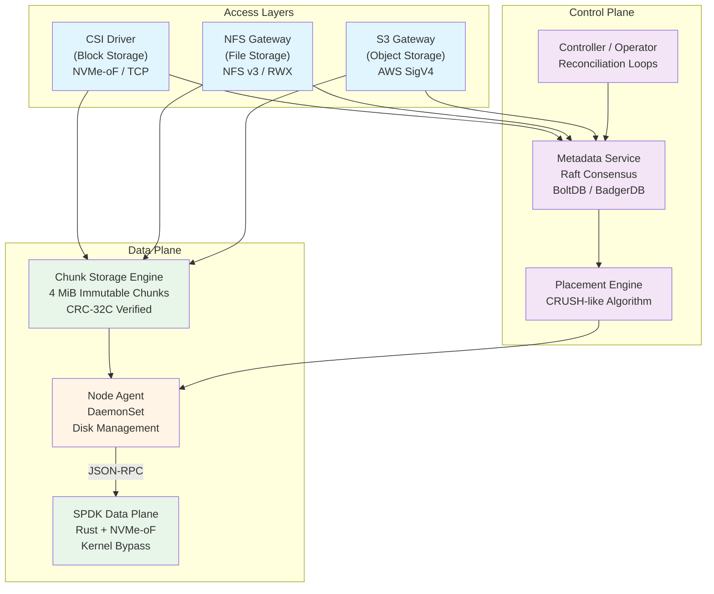
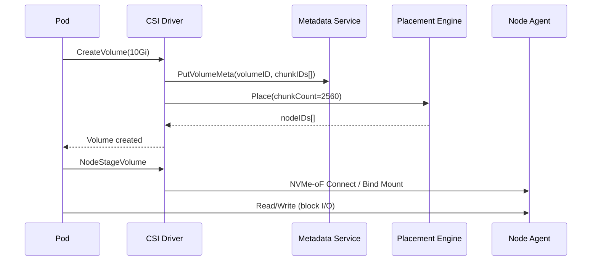
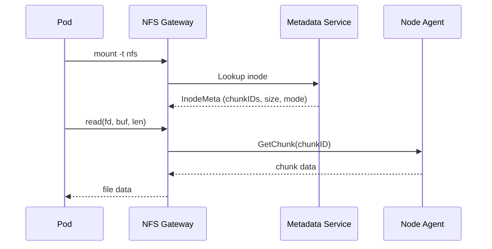
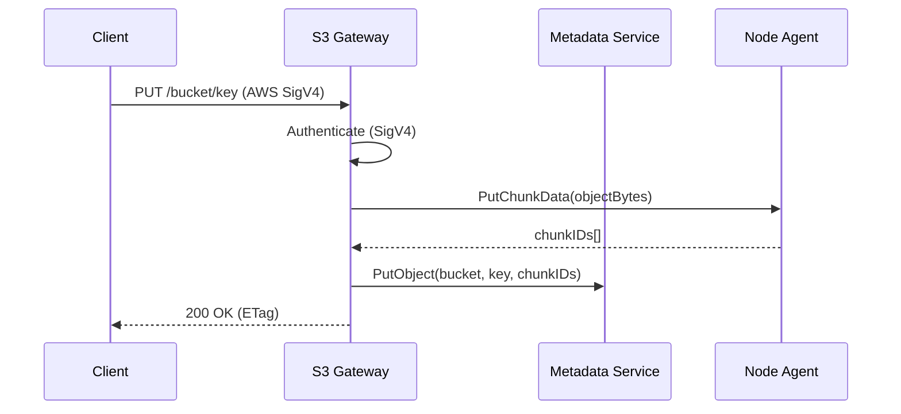
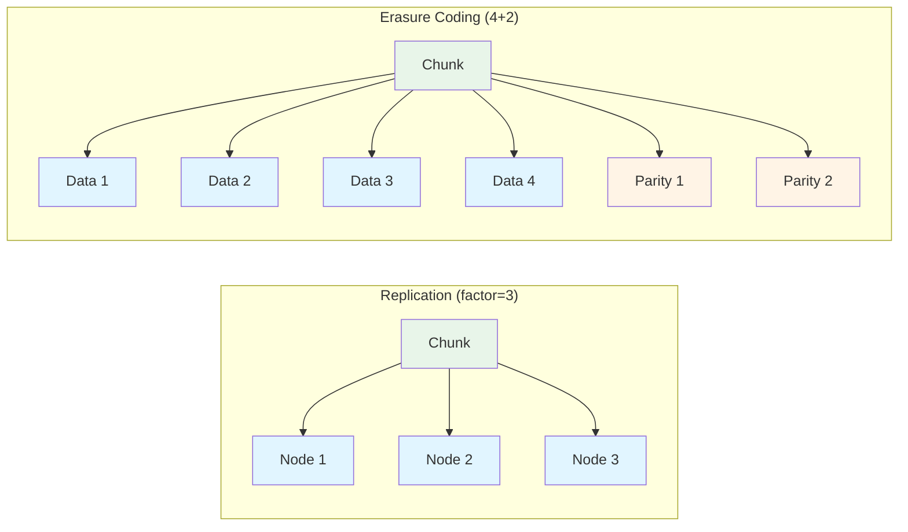

# Architecture Overview

NovaStor is a unified Kubernetes-native storage system that provides **block**, **file**, and **object** storage through a single, shared chunk storage engine. It is designed to run entirely within Kubernetes with zero external dependencies -- no etcd, ZooKeeper, or Ceph.

## System Architecture

## Core Principle: Everything is Chunks

The fundamental design insight of NovaStor is that all storage types can be reduced to ordered sequences of fixed-size chunks:

| Storage Type | Abstraction |
|---|---|
| **Block Volume** | Ordered sequence of 4 MiB chunks |
| **File** | Chunks + inode metadata (size, permissions, timestamps) |
| **Object** | Chunks + object metadata (key, content-type, user metadata) |

This unification enables a single engine to power three distinct access layers, dramatically simplifying the codebase, reducing operational burden, and enabling features like cross-layer deduplication.

### Chunk Properties

- **Fixed size**: 4 MiB (constant, not configurable in v1)
- **Immutable**: Once written, chunks are never modified -- updates create new chunks
- **Content-addressed**: Chunk IDs are derived from content hash for deduplication potential
- **Integrity-verified**: Every chunk carries a CRC-32C checksum verified on every read
- **Access-layer agnostic**: The chunk engine has no knowledge of volumes, files, or objects

## Data Flow

### Block Storage (CSI)

A 10 GiB block volume is decomposed into 2,560 chunks (10 GiB / 4 MiB). The CSI driver registers volume metadata with the Metadata Service, consults the Placement Engine for node assignments, and presents the volume to the pod via NVMe-oF/TCP (Phase 2) or bind mount.

### File Storage (NFS)

The NFS Gateway translates POSIX filesystem operations into chunk reads and writes. Each file's inode metadata (stored in the Metadata Service) maps file offsets to chunk IDs. NFS v3 is served over TCP with full file locking support.

### Object Storage (S3)

The S3 Gateway accepts standard AWS S3 API calls over HTTP. Object data is split into chunks and stored via the Node Agent, while object metadata (bucket, key, content-type, user metadata) is persisted in the Metadata Service.

## Data Protection

NovaStor supports two data protection modes, configurable per StoragePool. Both modes work identically across all three access layers.

### Replication

Synchronous N-way replication with configurable write quorum.

| Parameter | Default | Range |
|---|---|---|
| `factor` | 3 | 1-5 |
| `writeQuorum` | majority | 1 to factor |

**Overhead**: 3x raw capacity for the default factor of 3.

**Best for**: Latency-sensitive workloads (databases, real-time applications) where write amplification is acceptable.

### Erasure Coding

Reed-Solomon erasure coding using the `klauspost/reedsolomon` library.

| Parameter | Default | Range |
|---|---|---|
| `dataShards` | 4 | 2+ |
| `parityShards` | 2 | 1+ |

**Overhead**: 1.5x raw capacity for the default 4+2 configuration.

**Best for**: Capacity-efficient workloads (backups, archives, media) where some additional latency is acceptable.

## Kubernetes Integration

NovaStor is fully Kubernetes-native:

- **CRD-driven**: All storage resources (StoragePool, BlockVolume, SharedFilesystem, ObjectStore) are defined as Custom Resource Definitions
- **Operator-managed**: Reconciliation loops continuously drive resources toward desired state
- **Leader election**: HA controllers use Kubernetes leader election via `novastor-controller-leader-election` lease
- **Informer-based**: All Kubernetes API interactions use shared informer factories with lister caches -- no polling
- **Helm-deployable**: Single Helm chart deploys all components with sensible defaults

## Component Summary

| Component | K8s Resource | Port(s) | Role |
|---|---|---|---|
| Controller/Operator | Deployment (1 replica) | 8080 (metrics), 8081 (health) | Reconciles CRDs, manages recovery |
| Metadata Service | StatefulSet (3 replicas) | 7000 (Raft), 7001 (gRPC), 7002 (metrics) | Raft consensus, metadata storage |
| Node Agent | DaemonSet | 9100 (gRPC), 9101 (metrics) | Chunk storage, disk management |
| CSI Controller | Deployment (1 replica) | CSI socket | Volume lifecycle management |
| CSI Node | DaemonSet | CSI socket | Volume mount/unmount |
| NFS Gateway | Deployment | TCP (configurable) | NFS v3 file serving |
| S3 Gateway | Deployment (2 replicas) | 9000 (HTTP) | S3-compatible API |
| Scheduler Webhook | Deployment (2 replicas) | 9443 (webhook), 8080 (metrics), 8081 (health) | Auto-injects NovaStor scheduler for pods using NovaStor PVCs |

For detailed information about each component, see the [Component Details](components.md) page.
