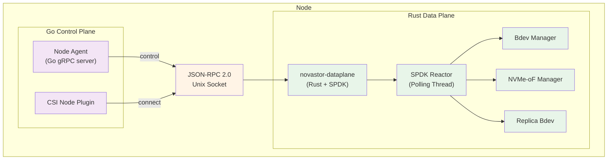
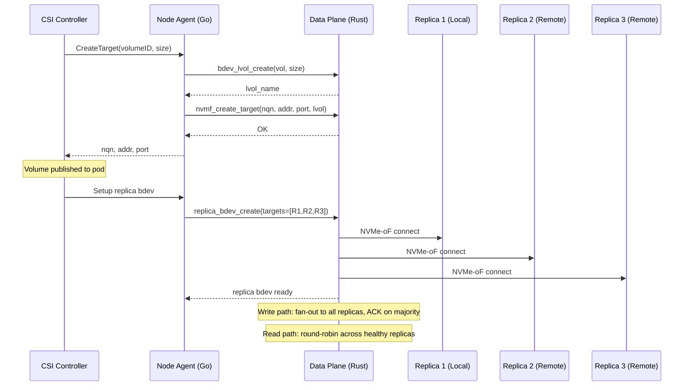
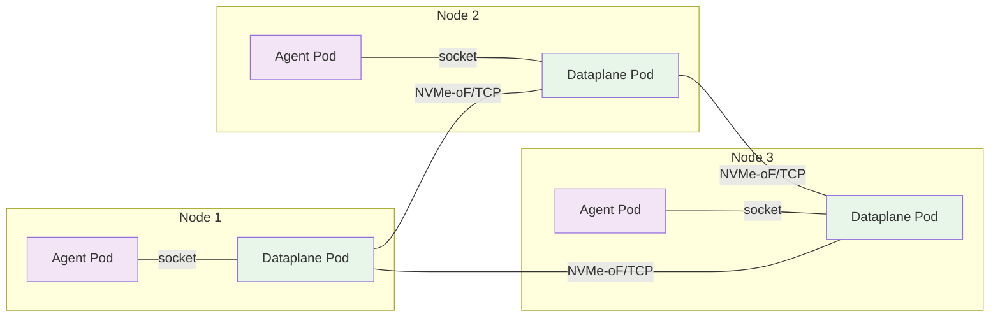

# SPDK Data Plane

NovaStor's high-performance data plane uses [SPDK (Storage Performance Development Kit)](https://spdk.io/) to provide kernel-bypass NVMe-oF target and initiator functionality. The data plane is implemented in Rust with SPDK FFI bindings and controlled by the Go agent via JSON-RPC.

## Architecture



## Data Flow: Replicated Volume



## Components

### novastor-dataplane (Rust binary)

The data-plane binary runs as a DaemonSet sidecar alongside the Go agent on each storage node. It provides:

| Component | Description |
|---|---|
| **SPDK Reactor** | Polling-mode event loop, avoids kernel context switches |
| **Bdev Manager** | Creates/deletes AIO, malloc, and logical volume bdevs |
| **NVMe-oF Manager** | Exposes bdevs as NVMe-oF/TCP targets, connects to remote targets |
| **Replica Bdev** | Custom bdev that replicates writes with quorum ACK and distributes reads |
| **JSON-RPC Server** | Unix domain socket server for Go control plane communication |

### JSON-RPC Interface

The Go agent communicates with the Rust data-plane over a Unix domain socket at `/var/tmp/novastor-spdk.sock` using JSON-RPC 2.0 (newline-delimited).

**Available methods:**

| Method | Description |
|---|---|
| `bdev_aio_create` | Create an AIO bdev backed by a file |
| `bdev_malloc_create` | Create an in-memory bdev (testing) |
| `bdev_lvol_create_lvstore` | Create a logical volume store |
| `bdev_lvol_create` | Create a logical volume |
| `bdev_delete` | Delete a bdev |
| `nvmf_create_target` | Create NVMe-oF target subsystem |
| `nvmf_delete_target` | Delete NVMe-oF target subsystem |
| `nvmf_connect_initiator` | Connect to a remote NVMe-oF target |
| `nvmf_disconnect_initiator` | Disconnect from a remote target |
| `nvmf_export_local` | Create loopback NVMe-oF for local consumption |
| `replica_bdev_create` | Create a replica bdev across targets |
| `replica_bdev_status` | Query replica health |
| `get_version` | Get data-plane version |

### Go Integration

| Package | File | Description |
|---|---|---|
| `internal/spdk` | `client.go` | JSON-RPC client with typed methods |
| `internal/spdk` | `process.go` | Start/stop/monitor the data-plane binary |
| `internal/agent` | `spdk_target_server.go` | SPDK-based NVMe-oF target gRPC service |
| `internal/agent` | `spdk_replica.go` | Replica bdev setup helper |
| `internal/csi` | `spdk_initiator.go` | SPDK-based NVMe-oF initiator |

## Configuration

### Feature Flag

The data plane mode is selected via the `--data-plane` flag:

```bash
# Agent
novastor-agent --data-plane=spdk --spdk-socket=/var/tmp/novastor-spdk.sock

# CSI Driver
novastor-csi --data-plane=spdk --spdk-socket=/var/tmp/novastor-spdk.sock
```

### Helm Values

```yaml
dataplane:
  enabled: true
  reactorMask: "0x1"     # CPU cores for SPDK reactor (hex mask)
  memSize: 2048           # HugePages memory in MB
  resources:
    limits:
      hugepages-2Mi: 2Gi  # Must match memSize
```

### HugePages

SPDK requires HugePages for DMA-safe memory. Each node must have HugePages configured:

```bash
# Configure 2GB of 2MB HugePages
echo 1024 > /sys/kernel/mm/hugepages/hugepages-2048kB/nr_hugepages
```

## Build

### Stub Mode (no SPDK libraries needed)

```bash
make build-dataplane
```

### Full SPDK Mode

```bash
make build-dataplane-spdk
```

### Docker Image

```bash
make docker-build-dataplane
```

## Deployment Topology



Each node runs the Go agent (control plane) and the Rust data-plane (SPDK) as separate DaemonSet pods sharing a Unix socket via hostPath volume. Data replication between nodes uses NVMe-oF/TCP directly between data-plane instances.
