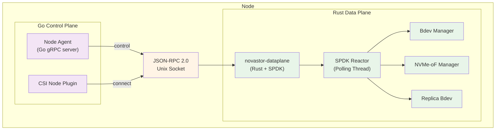
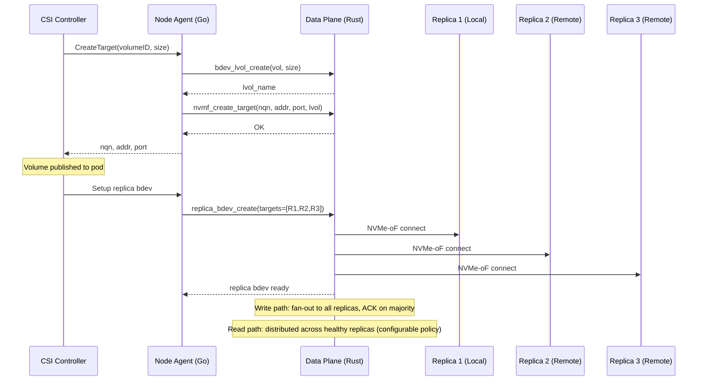
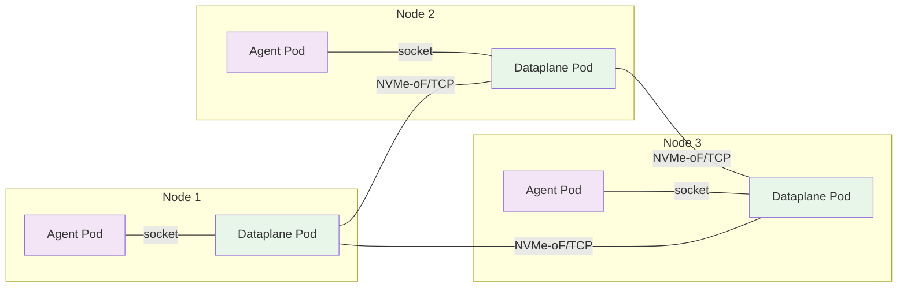
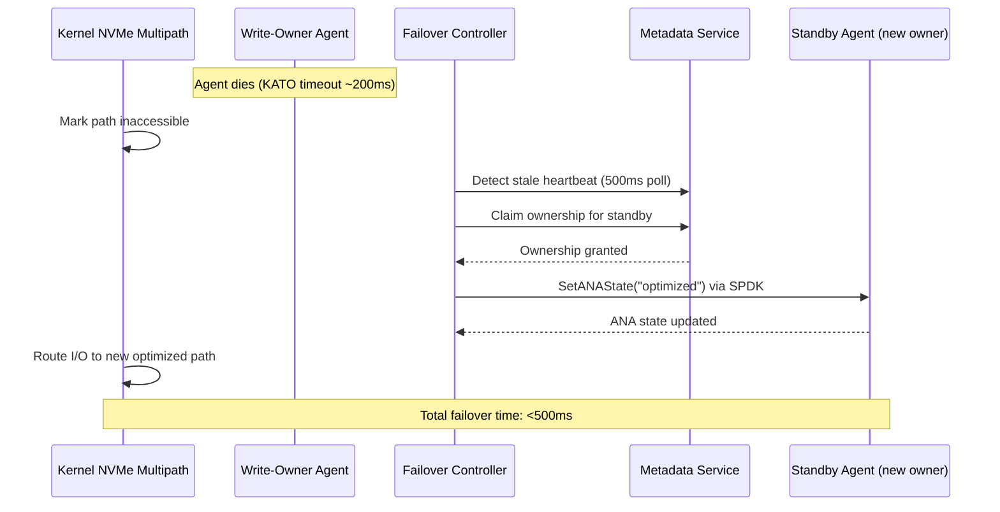

# SPDK Data Plane

NovaStor's high-performance data plane uses [SPDK (Storage Performance Development Kit)](https://spdk.io/) to provide kernel-bypass NVMe-oF target and initiator functionality. The data plane is implemented in Rust with SPDK FFI bindings and controlled by the Go agent via JSON-RPC.

## Architecture



## Data Flow: Replicated Volume



## Components

### novastor-dataplane (Rust binary)

The data-plane binary runs as a DaemonSet sidecar alongside the Go agent on each storage node. It provides:

| Component | Description |
|---|---|
| **SPDK Reactor** | Polling-mode event loop, avoids kernel context switches |
| **Bdev Manager** | Creates/deletes AIO, malloc, and logical volume bdevs |
| **NVMe-oF Manager** | Exposes bdevs as NVMe-oF/TCP targets, connects to remote targets |
| **Replica Bdev** | Custom bdev that replicates writes with quorum ACK and distributes reads |
| **JSON-RPC Server** | Unix domain socket server for Go control plane communication |

### Read Scaling Policies

The replica bdev supports three read distribution policies, selected at creation time via the `read_policy` parameter:

| Policy | Description | Best For |
|---|---|---|
| `round_robin` | Distributes reads evenly across all healthy replicas | General workloads, maximum aggregate throughput |
| `local_first` | Prefers the local replica for reads, falls back to round-robin for remote | Latency-sensitive workloads with local replica |
| `latency_aware` | Weighted round-robin based on per-replica EMA latency | Heterogeneous networks, asymmetric load |

**Latency-aware steering** tracks each replica's average read latency using an exponential moving average (EMA, alpha=0.1). Replicas with lower latency receive proportionally more reads via weighted round-robin. This automatically adapts to load imbalances and network asymmetry.

The agent auto-selects `local_first` when the consuming node has a local replica, and `latency_aware` otherwise.

### I/O Statistics

The `novastor_io_stats` RPC returns per-replica read distribution metrics:

```json
{
  "volume_id": "vol-abc",
  "replicas": [
    { "addr": "10.42.1.5", "reads_completed": 1500, "read_bytes": 6291456, "avg_read_latency_us": 120 },
    { "addr": "10.42.2.3", "reads_completed": 1480, "read_bytes": 6209536, "avg_read_latency_us": 135 },
    { "addr": "10.42.3.7", "reads_completed": 1520, "read_bytes": 6373376, "avg_read_latency_us": 118 }
  ],
  "total_read_iops": 4500,
  "total_write_iops": 1200,
  "write_quorum_latency_us": 250
}
```

### JSON-RPC Interface

The Go agent communicates with the Rust data-plane over a Unix domain socket at `/var/tmp/novastor-spdk.sock` using JSON-RPC 2.0 (newline-delimited).

**Available methods:**

| Method | Description |
|---|---|
| `bdev_aio_create` | Create an AIO bdev backed by a file |
| `bdev_malloc_create` | Create an in-memory bdev (testing) |
| `bdev_lvol_create_lvstore` | Create a logical volume store |
| `bdev_lvol_create` | Create a logical volume |
| `bdev_delete` | Delete a bdev |
| `nvmf_create_target` | Create NVMe-oF target subsystem |
| `nvmf_delete_target` | Delete NVMe-oF target subsystem |
| `nvmf_connect_initiator` | Connect to a remote NVMe-oF target |
| `nvmf_disconnect_initiator` | Disconnect from a remote target |
| `nvmf_export_local` | Create loopback NVMe-oF for local consumption |
| `replica_bdev_create` | Create a replica bdev across targets |
| `replica_bdev_status` | Query replica health and I/O stats |
| `novastor_io_stats` | Per-replica I/O distribution metrics |
| `nvmf_set_ana_state` | Set ANA state for an NVMe-oF target |
| `nvmf_get_ana_state` | Get ANA state for an NVMe-oF target |
| `replica_bdev_add_replica` | Add replica to running bdev |
| `replica_bdev_remove_replica` | Remove replica from running bdev |
| `get_version` | Get data-plane version |

### Go Integration

| Package | File | Description |
|---|---|---|
| `internal/spdk` | `client.go` | JSON-RPC client with typed methods |
| `internal/spdk` | `process.go` | Start/stop/monitor the data-plane binary |
| `internal/agent` | `spdk_target_server.go` | SPDK-based NVMe-oF target gRPC service |
| `internal/agent` | `spdk_replica.go` | Replica bdev setup helper |
| `internal/csi` | `spdk_initiator.go` | SPDK-based NVMe-oF initiator |
| `internal/agent/failover` | `controller.go` | Failover controller for ANA state management |

## Configuration

### Feature Flag

The data plane mode is selected via the `--data-plane` flag:

```bash
# Agent
novastor-agent --data-plane=spdk --spdk-socket=/var/tmp/novastor-spdk.sock

# CSI Driver
novastor-csi --data-plane=spdk --spdk-socket=/var/tmp/novastor-spdk.sock
```

### Helm Values

```yaml
dataplane:
  enabled: true
  reactorMask: "0x1"     # CPU cores for SPDK reactor (hex mask)
  memSize: 2048           # HugePages memory in MB
  resources:
    limits:
      hugepages-2Mi: 2Gi  # Must match memSize
```

### HugePages

SPDK requires HugePages for DMA-safe memory. Each node must have HugePages configured:

```bash
# Configure 2GB of 2MB HugePages
echo 1024 > /sys/kernel/mm/hugepages/hugepages-2048kB/nr_hugepages
```

## Build

### Stub Mode (no SPDK libraries needed)

```bash
make build-dataplane
```

### Full SPDK Mode

```bash
make build-dataplane-spdk
```

### Docker Image

```bash
make docker-build-dataplane
```

## Deployment Topology



Each node runs the Go agent (control plane) and the Rust data-plane (SPDK) as separate DaemonSet pods sharing a Unix socket via hostPath volume. Data replication between nodes uses NVMe-oF/TCP directly between data-plane instances.

## Failover and High Availability

NovaStor provides sub-second failover for block volumes using NVMe ANA (Asymmetric Namespace Access) multipath. The failover mechanism is active-passive: one replica agent owns writes while standby agents serve as hot backup paths. The Linux kernel's built-in NVMe multipath driver aggregates all paths transparently, so failover requires no application-level awareness.

### How It Works

Each replica agent exposes an NVMe-oF target for every volume it holds. The write-owner's target is marked **optimized** (active path) and standby agents are marked **non-optimized**. The Linux kernel's built-in NVMe multipath aggregates all paths into a single `/dev/nvmeXnY` device. On failure, the failover controller claims ownership via the metadata service and flips ANA states through SPDK JSON-RPC calls. The kernel automatically routes I/O to the new optimized path without any application intervention.

### Failover Sequence



**Step-by-step breakdown:**

1. **Write-owner agent dies** — the KATO (Keep Alive Timeout) expires after ~200ms, and the kernel marks the NVMe path as inaccessible.
2. **Kernel marks path inaccessible** — in-flight I/O is queued by the multipath layer while waiting for an alternative path.
3. **Failover controller detects stale heartbeat** — the controller polls heartbeats every 500ms and identifies the dead agent.
4. **Controller claims ownership via metadata service** — the standby agent is promoted to write-owner through a Raft-committed ownership transfer.
5. **New owner sets ANA state to "optimized" via SPDK** — the `nvmf_set_ana_state` JSON-RPC call updates the NVMe-oF target's ANA group.
6. **Kernel routes I/O to new optimized path** — the multipath driver detects the new optimized path and drains the queued I/O.
7. **Total failover time: <500ms** — from agent death to I/O resumption on the new path.

### Failover Configuration

The following Helm values control failover behavior:

```yaml
agent:
  heartbeatInterval: "500ms"
  failover:
    enabled: true
    katoTimeout: "200ms"
dataplane:
  enabled: true
```

| Value | Default | Description |
|---|---|---|
| `agent.heartbeatInterval` | `500ms` | How often agents send heartbeats to the metadata service |
| `agent.failover.enabled` | `true` | Enable ANA multipath failover |
| `agent.failover.katoTimeout` | `200ms` | NVMe KATO timeout before kernel marks a path dead |
| `dataplane.enabled` | `false` | Enable SPDK data plane (required for ANA failover) |

### Components Involved

| Component | Role |
|---|---|
| Failover Controller (`internal/agent/failover/`) | Watches ownership, manages ANA states |
| SPDK Client (`internal/spdk/client.go`) | `SetANAState` / `GetANAState` JSON-RPC calls |
| Metadata Service (`internal/metadata/ownership.go`) | Ownership tracking, heartbeat-based failure detection |
| CSI Controller (`internal/csi/controller.go`) | Multi-target provisioning with ANA group IDs |
| CSI Node (`internal/csi/node.go`) | Kernel NVMe multipath attachment |
