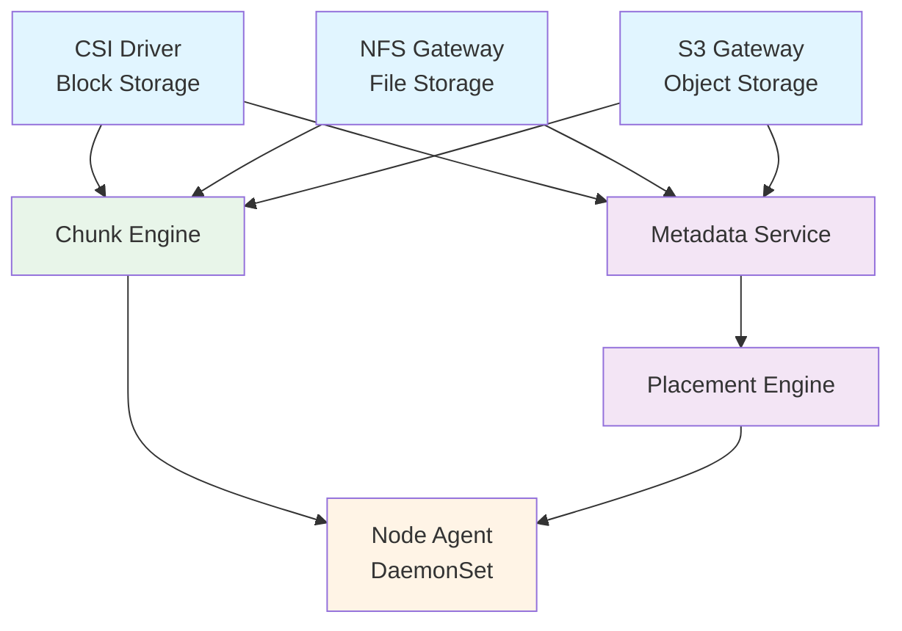

# NovaStor

**Unified Kubernetes-Native Storage -- Block, File, and Object**

NovaStor is a distributed storage system built for Kubernetes that provides block (CSI), file (NFS), and object (S3-compatible) storage through a single, shared chunk storage engine. It runs entirely within Kubernetes with zero external dependencies.

## Key Features

- **Block Storage** -- CSI driver with NVMe-oF/TCP transport for near-local-disk latency
- **File Storage** -- NFS v3 gateway with ReadWriteMany (RWX) support
- **Object Storage** -- S3-compatible API with multipart uploads, presigned URLs, and versioning
- **Unified Engine** -- Single chunk-based storage engine powering all three access layers
- **Flexible Data Protection** -- Per-pool choice of replication (factor 1-5) or erasure coding (Reed-Solomon)
- **Kubernetes Native** -- CRD-driven, operator-managed, Helm-deployable
- **Zero External Dependencies** -- No etcd, ZooKeeper, or Ceph required
- **Automatic Recovery** -- Detects node failures and re-replicates under-replicated chunks
- **Built-in Observability** -- Prometheus metrics from every component with ServiceMonitor support

## Architecture

**Everything is chunks.** A block volume is an ordered sequence of 4 MiB chunks. A file is chunks plus inode metadata. An object is chunks plus object metadata. One engine, three access layers.

## Documentation

### Getting Started

- [Quick Start Guide](deployment/quickstart.md) -- Install NovaStor and provision your first volume in minutes

### Architecture

- [Architecture Overview](architecture/overview.md) -- System design, data flows, and core principles
- [Component Details](architecture/components.md) -- In-depth look at each NovaStor component

### Deployment

- [Quick Start](deployment/quickstart.md) -- Prerequisites, Helm install, first volume
- [Helm Chart Reference](deployment/helm-values.md) -- All configurable parameters
- [RBAC Configuration](deployment/rbac.md) -- Permissions and security setup

### Operations

- [Monitoring Guide](operations/monitoring.md) -- Prometheus metrics, Grafana dashboards, alerting rules
- [Failure Recovery](operations/recovery.md) -- Automatic recovery, node failure handling, monitoring progress
- [Encryption at Rest](operations/encryption.md) -- Key management, enabling encryption, key rotation

### API Reference

- [CRD Reference](api/crds.md) -- StoragePool, BlockVolume, SharedFilesystem, ObjectStore specifications
- [S3 API Compatibility](api/s3.md) -- Supported operations, authentication, usage examples

### Development

- [Contributing Guide](development/contributing.md) -- Build, test, lint, code organization, CI pipeline

## Quick Reference

| Component | Binary | K8s Resource | Ports |
|---|---|---|---|
| Controller | `novastor-controller` | Deployment | 8080 (metrics), 8081 (health) |
| Metadata | `novastor-meta` | StatefulSet (3) | 7000 (Raft), 7001 (gRPC), 7002 (metrics) |
| Agent | `novastor-agent` | DaemonSet | 9100 (gRPC), 9101 (metrics) |
| CSI Controller | `novastor-csi` | Deployment | CSI socket |
| CSI Node | `novastor-csi` | DaemonSet | CSI socket |
| NFS Gateway | `novastor-filer` | Deployment | TCP (configurable) |
| S3 Gateway | `novastor-s3gw` | Deployment (2) | 9000 (HTTP) |
| Scheduler Webhook | `novastor-webhook` | Deployment (2) | 9443 (webhook), 8080 (metrics), 8081 (health) |

## Project Links

- **Source Code**: [github.com/azrtydxb/novastor](https://github.com/azrtydxb/novastor)
- **Container Images**: `ghcr.io/azrtydxb/novastor/novastor-*`
- **Module**: `github.com/azrtydxb/novastor`
- **License**: See repository
