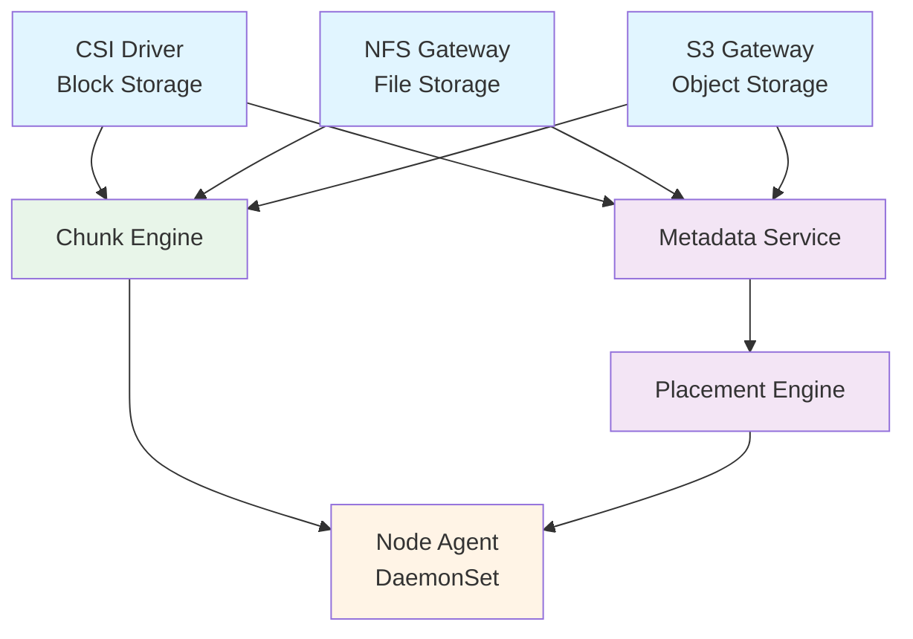

# NovaStor

**Unified Kubernetes-Native Storage — Block, File, and Object**

NovaStor is a distributed storage system built for Kubernetes that provides block (CSI), file (NFS), and object (S3-compatible) storage through a single, shared chunk storage engine.

## Key Features

- **Block Storage** — CSI driver with NVMe-oF/TCP transport for near-local-disk latency
- **File Storage** — NFS v4.1 gateway with ReadWriteMany (RWX) support
- **Object Storage** — S3-compatible API for application assets and backups
- **Unified Engine** — Single chunk-based storage engine powering all three access layers
- **Flexible Data Protection** — Per-pool choice of replication or erasure coding for any access layer
- **Kubernetes Native** — CRD-driven, operator-managed, Helm-deployable
- **Zero External Dependencies** — No etcd, ZooKeeper, or Ceph required

## Architecture

## Quick Start

See the [Quick Start Guide](getting-started/quickstart.md) to get NovaStor running on your cluster.
