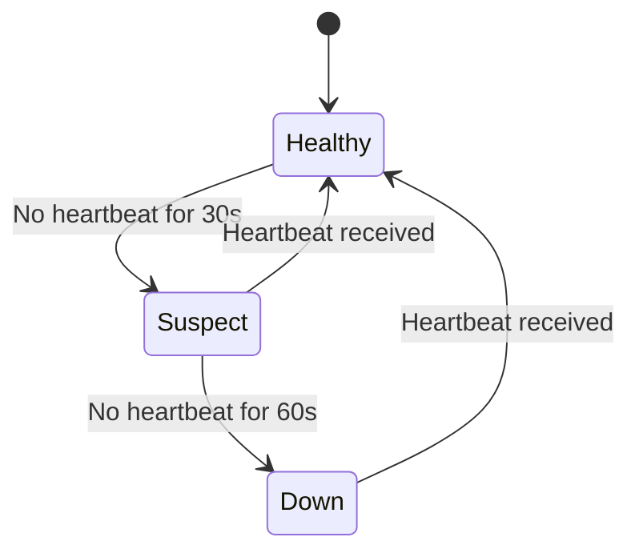

# Failure Recovery

NovaStor includes an automatic recovery subsystem that detects node failures and re-replicates under-replicated chunks to restore the configured data protection level. This page explains how recovery works, how to monitor it, and how to tune its behavior.

## How Recovery Works

The recovery subsystem runs inside the controller as a background loop that executes every 10 seconds. Each cycle performs four steps:


### Step 1: Refresh Heartbeats

The controller fetches the current node list from the Metadata Service and checks each node's `LastHeartbeat` timestamp. Nodes whose heartbeat is within the `heartbeat-timeout` window are marked as `Healthy`.

### Step 2: Check Node Status

Nodes transition through three health states based on elapsed time since their last heartbeat:

| State | Condition | Default Timeout |
|---|---|---|
| **Healthy** | Last heartbeat within suspect timeout | -- |
| **Suspect** | Last heartbeat older than suspect timeout but within down timeout | 30 seconds |
| **Down** | Last heartbeat older than down timeout | 60 seconds |



### Step 3: Schedule Recovery Tasks

For each node in the `Down` state, the controller:

1. Queries the Metadata Service for all chunks stored on the failed node
2. For each chunk, finds surviving replicas on other nodes
3. Selects a healthy destination node that does not already hold the chunk
4. Creates a recovery task with a priority based on surviving replica count (fewer surviving replicas = higher priority)

Tasks are sorted by priority so the most urgently under-replicated chunks are recovered first.

### Step 4: Process Recovery Queue

The controller processes recovery tasks with a configurable concurrency limit (default: 4 concurrent operations). For each task:

1. **Replicate**: Copy the chunk data from a surviving replica node to the new destination node
2. **Update Placement**: Update the chunk's placement map in the Metadata Service to reflect the new node assignment
3. **Increment Counter**: Update the `novastor_controller_recovery_chunks_completed_total` metric

## Node Failure Handling

### Single Node Failure

When a single node fails in a 3-replica configuration:

1. The node misses heartbeats and transitions to `Suspect` after 30 seconds
2. After 60 seconds without a heartbeat, the node transitions to `Down`
3. The controller actively probes the node using the health checker
4. If the probe confirms the node is unreachable, recovery begins
5. All chunks that had replicas on the failed node are re-replicated to healthy nodes
6. The cluster returns to full data protection (3 replicas per chunk) within minutes

### Multiple Node Failures

If multiple nodes fail simultaneously, the recovery system prioritizes chunks with the fewest surviving replicas. A chunk with only one surviving replica is recovered before a chunk with two surviving replicas.

!!! warning "Quorum Loss"
    If more nodes fail than the data protection level allows (e.g., 2 out of 3 replicas lost), some chunks become unavailable. The system will recover them once at least one surviving replica comes back online.

### Node Rejoin

If a previously failed node comes back online and sends a heartbeat, it immediately transitions back to `Healthy`. The controller will not schedule new recovery tasks for chunks that already have sufficient replicas.

## Configuration

Recovery behavior is configured via controller flags:

| Flag | Default | Description |
|---|---|---|
| `--recovery-enabled` | `true` | Enable or disable automatic recovery |
| `--heartbeat-timeout` | `60s` | Duration after which a node without heartbeat is considered down |
| `--recovery-concurrency` | `4` | Maximum number of concurrent chunk recovery operations |

### Tuning Recommendations

**Heartbeat Timeout**: Set this higher than the node agent's heartbeat interval (default 30s). A timeout of 60s allows for two missed heartbeats before triggering recovery. In unstable networks, increase to 120s to avoid false positives.

**Recovery Concurrency**: Higher concurrency recovers faster but consumes more network bandwidth and I/O. For large clusters with many disks, increase to 8-16. For small clusters, keep at 4.

## Monitoring Recovery Progress

### Key Metrics

| Metric | Description |
|---|---|
| `novastor_controller_recovery_chunks_pending` | Number of chunks waiting to be recovered |
| `novastor_controller_recovery_chunks_completed_total` | Cumulative count of recovered chunks |

### Recovery Dashboard Queries

**Current Recovery Status** (Stat panel):
```promql
novastor_controller_recovery_chunks_pending
```

**Recovery Throughput** (Time series):
```promql
rate(novastor_controller_recovery_chunks_completed_total[5m])
```

**Estimated Time to Completion** (Stat panel):
```promql
novastor_controller_recovery_chunks_pending / rate(novastor_controller_recovery_chunks_completed_total[5m])
```

### Controller Logs

The controller logs recovery events at various levels:

```
# Node state transitions
WARN  node marked SUSPECT  {"nodeID": "worker-3", "elapsed": "35s"}
WARN  node marked DOWN     {"nodeID": "worker-3", "elapsed": "65s"}

# Recovery scheduling
WARN  recovering down node {"nodeID": "worker-3", "lastHeartbeat": "2025-01-15T10:30:00Z"}

# Chunk replication
INFO  chunk replicated     {"chunkID": "abc123", "source": "worker-1", "dest": "worker-4"}
ERROR failed to replicate  {"chunkID": "def456", "source": "worker-2", "dest": "worker-5", "error": "..."}
```

### Alerting

Set up an alert for stalled recoveries:

```yaml
- alert: NovaStorRecoveryStalled
  expr: novastor_controller_recovery_chunks_pending > 0
  for: 30m
  labels:
    severity: warning
  annotations:
    summary: "NovaStor recovery has been pending for over 30 minutes"
```

## Manual Recovery Operations

In some cases, you may need to manually intervene:

### Force Node Deregistration

If a node is permanently removed from the cluster, you can force its deregistration through the metadata service. This triggers immediate recovery of all chunks that were on the removed node.

### Pause Recovery

To temporarily pause recovery (e.g., during maintenance), restart the controller with `--recovery-enabled=false`. Re-enable it afterward to resume.

### Verify Data Integrity After Recovery

After a recovery event completes (pending count reaches 0), run a manual scrub to verify all chunks have valid checksums:

```bash
# Check scrub status via metrics
curl -s http://<agent>:9101/metrics | grep novastor_agent_scrub
```

The scrub runs automatically every 24 hours (configurable via `--scrub-interval` on the agent), but you can trigger it sooner by restarting the agent pods.
