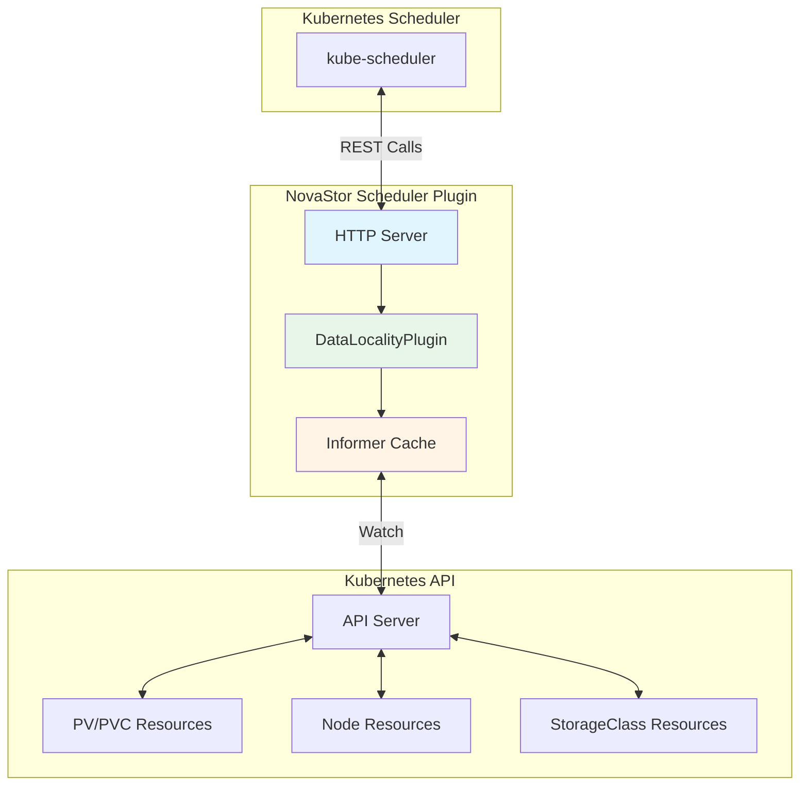

# Scheduler Plugin

The NovaStor data-locality scheduler plugin is a Kubernetes scheduler extension that prefers nodes holding local volume replicas to optimize data locality and reduce network traffic.

## Overview

When scheduling pods that use NovaStor PVCs, the plugin scores nodes based on whether they already hold data for the requested volumes. This optimization:

- Reduces network traffic by reading data locally
- Improves performance by avoiding remote data access
- Works with both RWO (ReadWriteOnce) and RWX (ReadWriteMany) volumes

## Architecture



## Scoring Logic

The plugin scores nodes from 0 to 100 based on:

1. **RWO Volumes (ReadWriteOnce)**
   - Nodes with topology matching the PV's node affinity: `localityWeight` points
   - Nodes without matching topology: 0 points
   - Bonus: `minLocalityScore` points for nodes with any local data

2. **RWX Volumes (ReadWriteMany)**
   - `rwx-mode=locality`: Same as RWO
   - `rwx-mode=balanced`: Storage nodes receive `ScoreMax/2` points
   - `rwx-mode=any`: All nodes receive neutral score

## Configuration

| Flag | Default | Description |
|------|---------|-------------|
| `--locality-weight` | 10 | Weight added to score for nodes with local data |
| `--min-locality-score` | 1 | Minimum score bonus for nodes with local data |
| `--rwx-mode` | `balanced` | RWX handling mode: `locality`, `balanced`, or `any` |
| `--port` | 10251 | HTTP port for health checks and scoring API |

## Deployment

The scheduler plugin runs as a Deployment (or DaemonSet for node-local awareness) in the `kube-system` namespace.

### Prerequisites

- Kubernetes cluster with NovaStor CSI driver installed
- Nodes labeled with `novastor.io/storage-node=true` for storage nodes

### Install Manifests

```bash
kubectl apply -f deploy/manifests/scheduler.yaml
```

### Configure Pod Scheduling

Pods using NovaStor PVCs will automatically use the data-locality scheduler if configured via the webhook injector, or you can explicitly set:

```yaml
apiVersion: v1
kind: Pod
spec:
  schedulerName: novastor-scheduler
  containers:
  - name: app
    volumeMounts:
    - name: data
      mountPath: /data
  volumes:
  - name: data
    persistentVolumeClaim:
      claimName: novastor-pvc
```

## Storage Class Integration

NovaStor storage classes are automatically detected by the provisioner name `novastor.csi.novastor.io`.

For RWX volumes, you can specify access mode in allowed topologies:

```yaml
apiVersion: storage.k8s.io/v1
kind: StorageClass
metadata:
  name: novastor-rwx
provisioner: novastor.csi.novastor.io
allowedTopologies:
- matchLabelExpressions:
  - key: novastor.io/access-mode
    values:
    - RWX
```

## API Endpoints

| Endpoint | Method | Description |
|----------|--------|-------------|
| `/healthz` | GET | Health check |
| `/score` | POST | Score a node for a pod |

### Score API

Request:
```json
{
  "podName": "my-pod",
  "podNamespace": "default",
  "nodeName": "node-1"
}
```

Response:
```json
{
  "score": 75
}
```

## Metrics and Monitoring

The plugin exposes structured logging for scoring decisions:

```
{"level":"debug","msg":"scored node for pod","node":"storage-node-1","pod":"my-pod","score":75,"localDataCount":2}
```

## Troubleshooting

### Pods Not Scheduled on Local Nodes

1. Verify PVC is bound and PV has correct topology
2. Check node has `novastor.io/storage-node=true` label
3. Verify `rwx-mode` setting matches volume type
4. Check plugin logs for scoring decisions

### High Network Traffic Despite Plugin

1. Ensure webhook injector is deployed
2. Verify pods have `schedulerName: novastor-scheduler`
3. Check storage node topology labels match PV topology
